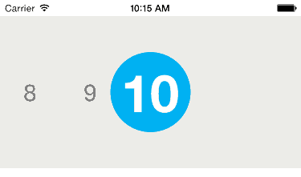

MILRatingCollectionView
=======================

MILRatingCollectionView is an easy to use, drop-in, reusable UI component built in Swift to display a __horizontal number picker__. It has a customizable number range and font so you can display a beautiful number picker, however you like.

## Installation

Simple copy `MILRatingCollectionView.swift` into your Xcode project.

### Usage

Open `ViewControllerExample.swift` to see an example in context.

1. Create a `UICollectionView` in storyboard or in code and position it however you like.
	
1. In the `viewDidLoad` of your viewController, set the background color of the centered circle. In this example, `milRatingCollectionView` is an instance of `MILRatingCollectionView`

        milRatingCollectionView.circularView.backgroundColor = UIColor.redColor()

1. Optionally, you can specify the number range to display using an `NSRange`. Where `.location` is the starting point and `.length` is the number to end on + 1. For example,

        milRatingCollectionView.numberRange = NSMakeRange(1, 11) // 1 to 10 range
The default range is 0 to 10 if `numberRange` isn't set.
1. If desired, you can change the font name from Helvetica to whatever you like, assuming there is a Medium and Bold version of that font. You can change the font at the top of `MILRatingCollectionView.swift`,
        
        let selectedFont = "Helvetica"

## Requirements
* Currently, MILRatingCollectionView is set up to work with iOS 8+
* It may take a small amount of adjustment to work on iOS 7

## Author

Created by [Taylor Franklin](https://github.com/tfrank64)
([tfrank64](https://twitter.com/tfrank64)) at the [IBM Mobile Innovation Lab](http://www-969.ibm.com/innovation/milab/)

## License

MILRatingCollectionView is available under the Apache 2.0 license. See the LICENSE file for more info.

